# Rally Transbetxí App 🏁

## 📋 Table of Contents
- [Project Overview 🚀](#project-overview)
- [About the Rally 🏎️](#about-the-rally)
- [Technologies Used 💻](#technologies-used)
- [Current App State 🚧](#current-app-state)
- [Repository Status ℹ️](#repository-status)
- [Screenshots 📸](#screenshots)
- [Installation 📲](#installation)
- [License 📄](#license)
- [Contact 📬](#contact)

## 🚀 Project Overview

This repository contains information about the Rally Transbetxí App, a mobile application both for iOS & Android designed to bring real-time updates and results to spectators of the traditional Transbetxí Rally. The app allows fans to follow the race progress, view stage times, and stay updated with the latest news about the event.

## 🏎️ About the Rally

Just like every year since 1988, the [Rally Transbetxí](https://www.transbetxi.com/) returns to Betxí, Castellón (Spain), featuring a **unique motorsport event** – the motocultor rally. A motocultor is a small agricultural machine with no more than 10 horsepower. While its power might not be impressive, things change when we swap the original engine for a modified 250cc Bultaco engine, producing around 40 horsepower and reaching speeds of up to 100 kilometers per hour. Quite a transformation, right? 🏎️💨

With the increased power comes the need for improved brakes, suspensions, and tires. Even so, motocultores remain somewhat unstable, leading to the formation of two-member teams: a rider and a co-pilot who acts as a counterbalance during turns, much like a sidecar passenger.

  
*Photo credits: [Alejandro Tinieblas](https://www.alejandromilart.com/motorets-transbetxi-2018/)*

This well-established competition revolves around this concept, and this year it introduces an exciting addition: our mobile application that allows spectators to follow live timing results and get real-time updates on the race progress. Now you can stay connected with all the action happening on the track, witnessing the motocultores incredible speed and skill firsthand.

📢 Join us as we celebrate the legacy of the **Rally Transbetxí**.  
📆 **Saturday, April 26, 2025**, until **Sunday, April 27, 2025**.  
📍 **Betxí, Castellón (Spain)**  
🌐 [https://www.transbetxi.com/](https://www.transbetxi.com/)

## 💻 Technologies Used

This project leverages cutting-edge mobile development technologies to provide a seamless cross-platform experience while maintaining native performance. The technical stack includes:

### 🔄 Cross-Platform Foundation
- **[Kotlin Multiplatform (KMP)](https://kotlinlang.org/docs/multiplatform.html)** - Sharing code across Android and iOS:
  - Data layer (repositories, data sources)
  - Domain layer (business logic, use cases) 
  - Presentation layer (ViewModels)
  - UI layer (common components)

### 📱 User Interface
- **[Compose Multiplatform](https://www.jetbrains.com/compose-multiplatform/)** - UI toolkit that extends Jetpack Compose to iOS, enabling shared UI components
- **[Material Design 3](https://m3.material.io/)** - Design system providing consistent theming throughout the app
- **Platform-specific implementations**:
  - Custom SwiftUI screens for iOS map functionality
  - Native API integrations for location services on both platforms

### 🗺️ Mapping & Location Services
- **[Google Maps API](https://github.com/googlemaps)** - For Android stage mapping and navigation
- **[Apple Maps](https://developer.apple.com/maps/)** - Custom native implementation for iOS stage mapping through MapKit
- **Platform-specific location APIs** - For determining user position and providing directions to stage starting points

### 🔥 Backend & Data
- **Firebase Ecosystem**
  - Firestore for structured data (participant information, stage details, results, etc.)
  - Storage for media assets (photos, sponsors, news media)
  - Cloud Messaging for push notifications and real-time race updates
  - Crashlytics for crash reporting and performance monitoring
  - Security Rules with Google Play and Firebase App Check integration for data protection
- **[GitLive Firebase](https://github.com/GitLiveApp/firebase-kotlin-sdk)** - Kotlin-first Firebase libraries for cross-platform implementation (as official KMP Firebase support from Google remains undone as of 2025)

### 🏗️ Architecture & Utilities
- **Clean Architecture** - For maintainable separation of concerns
- **MVVM Pattern** - For UI state management
- **Kotlin Coroutines & Flows** - For asynchronous programming and reactive data streams
- **Koin** - For dependency injection across platforms
- **Ktor Client** - For additional network communications
- **Room** - For local data persistence on both platforms
- **DataStore** - For preferences and small data storage
- **Compose Navigation** - For routing within the Android application

## 🚧 Current App State

*The application is currently in active development with a private testing phase underway. Due to the timeline of discussions with the rally organization, the app will not be publicly available for the 2025 edition. We are targeting a full public release for the 2026 event, with limited testing for this year's rally.*

## ℹ️ Repository Status

**Important Note:** This repository serves as an informational showcase only and does not contain the application's source code. The code remains private as the project is being developed for eventual transfer to the Rally Transbetxí organization, which prefers to maintain the codebase as proprietary software. This documentation is provided to demonstrate the technical concepts and approaches used in the development process.

## 📸 Screenshots

### Home & Settings
| 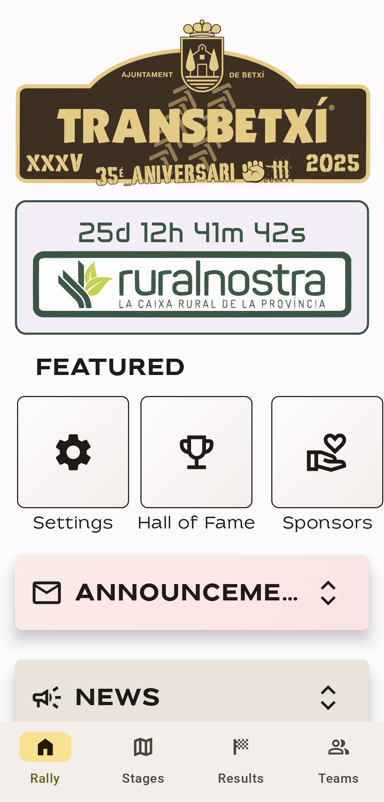 | 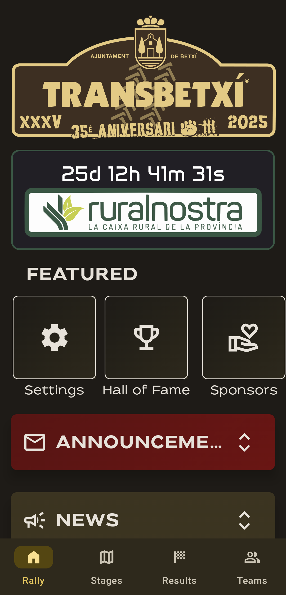 | 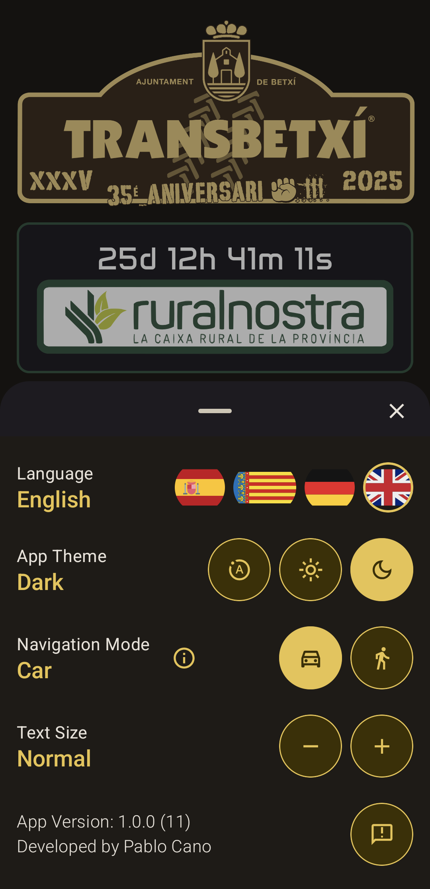 |
|:-------------------:|:------------------:|:------------------:|
| **Home Screen (Light)** | **Home Screen (Dark)** | **Settings (Dark)** |

### News & Activities
| 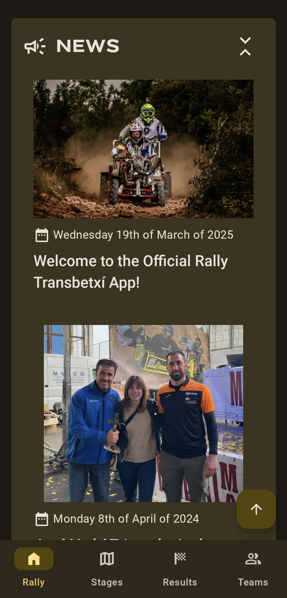 | 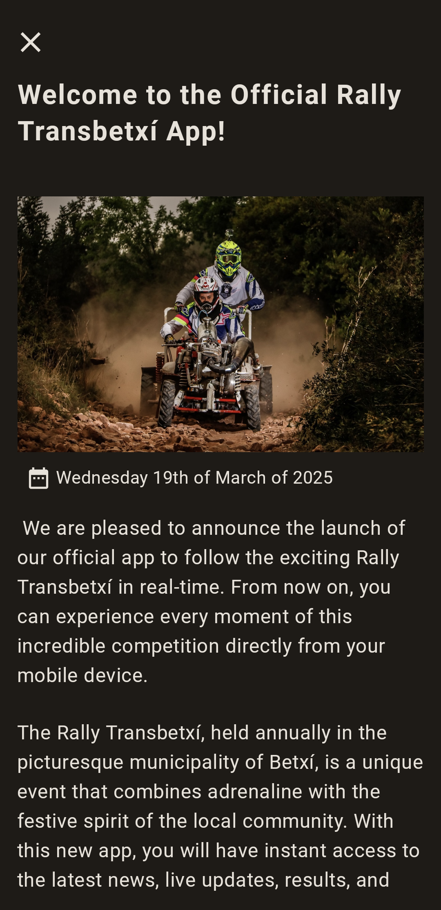 | 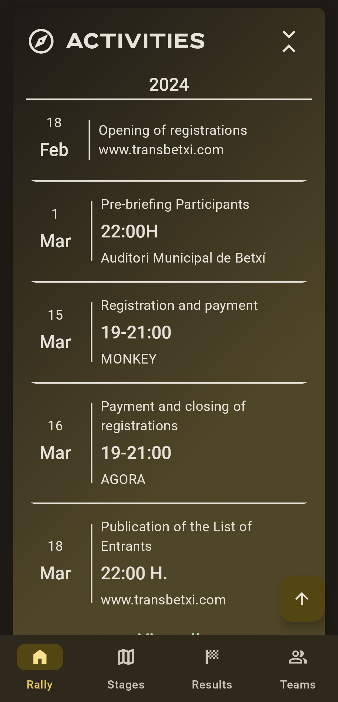 |
|:-------------------:|:------------------:|:------------------:|
| **News Feed** | **News Detail** | **Activities** |

### Stages & Maps
| 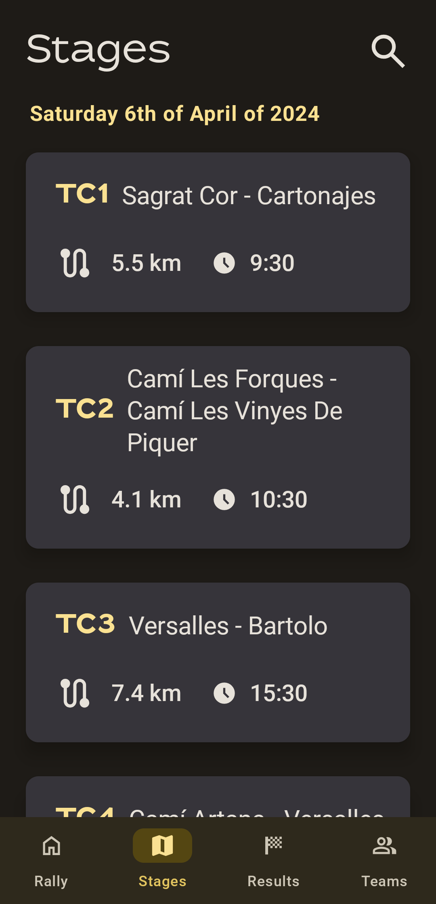 | 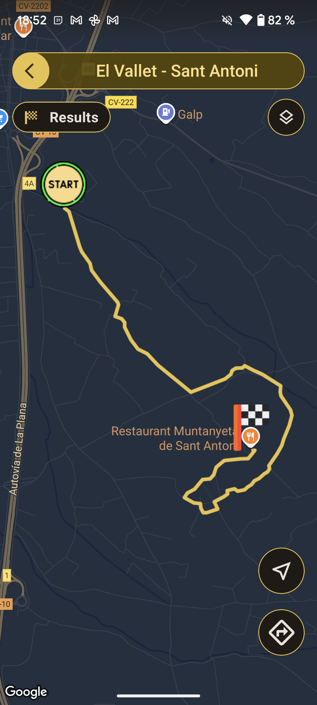 | 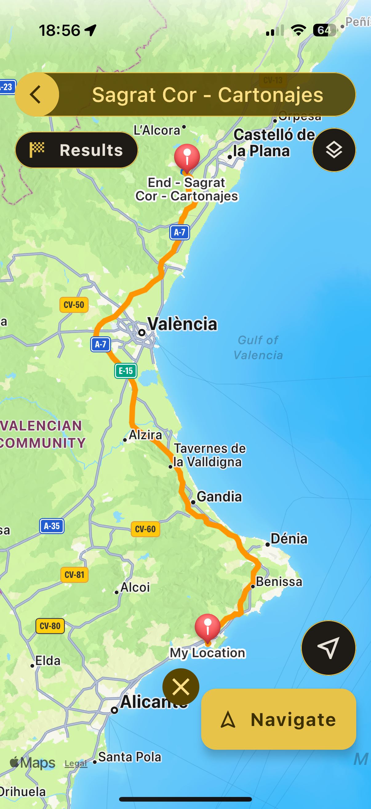 |
|:-------------------:|:------------------:|:------------------:|
| **Stages List** | **Stage Map (Android)** | **Stage Map (iOS) with navigation enabled** |

### Results
| 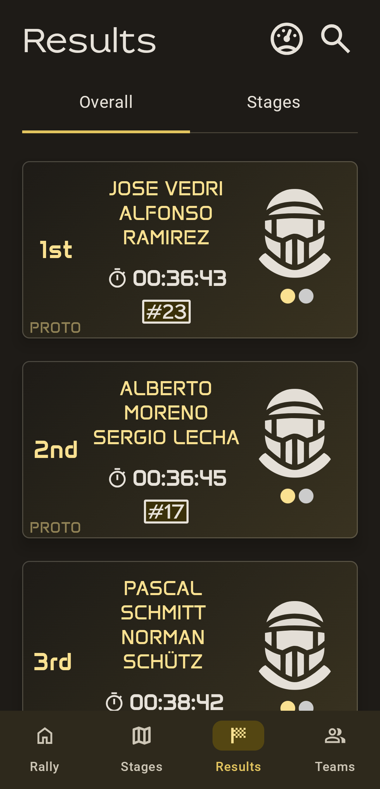 | 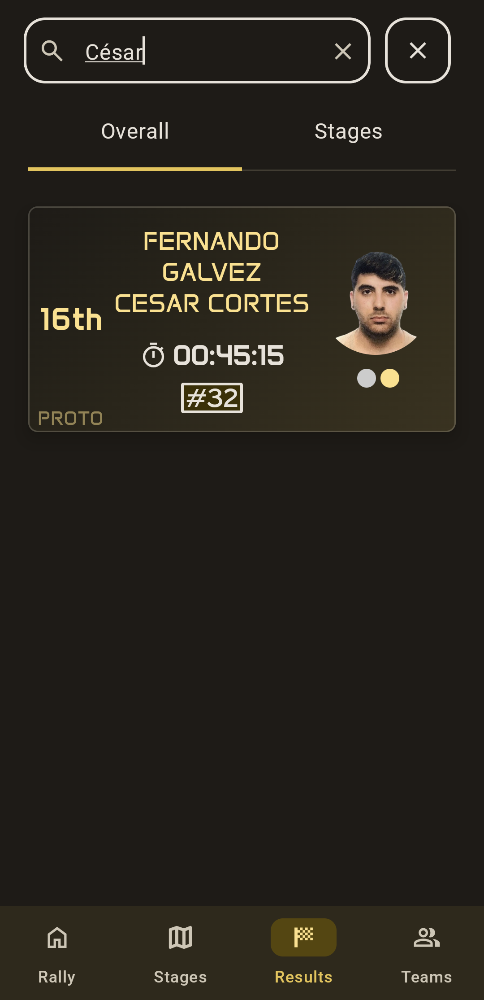 | 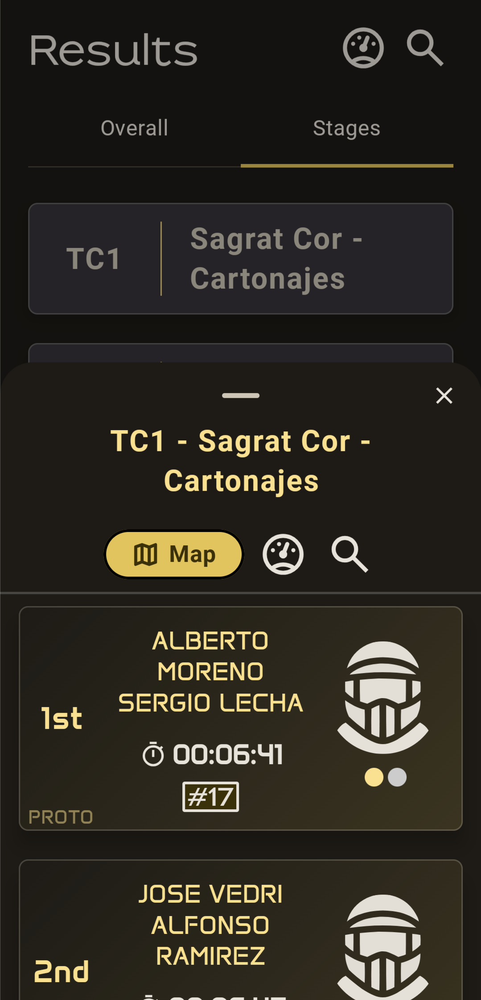 |
|:-------------------:|:------------------:|:------------------:|
| **Results List** | **Filtered Results** | **Stage Results Bottom Sheet** |

### Teams
| 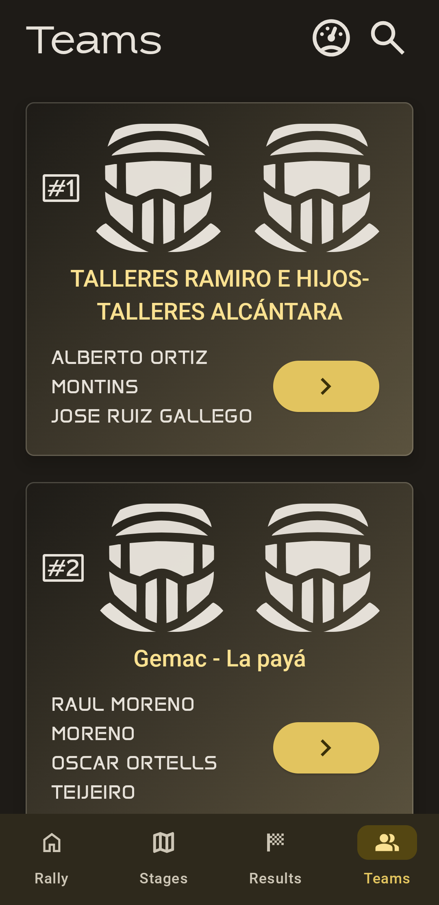 | 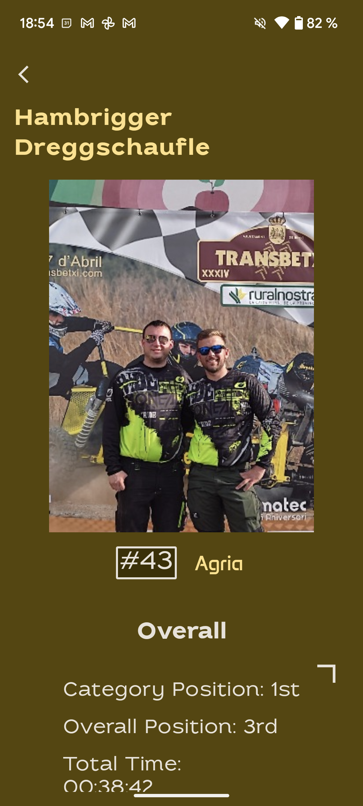 | 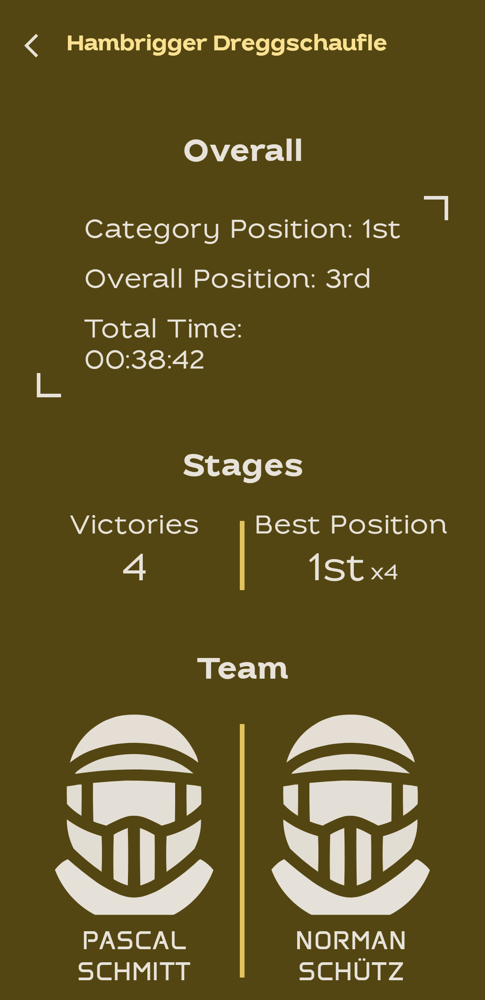 |
|:-------------------:|:------------------:|:------------------:|
| **Teams List** | **Team Details** | **Extended Team Info** |

### Information
| 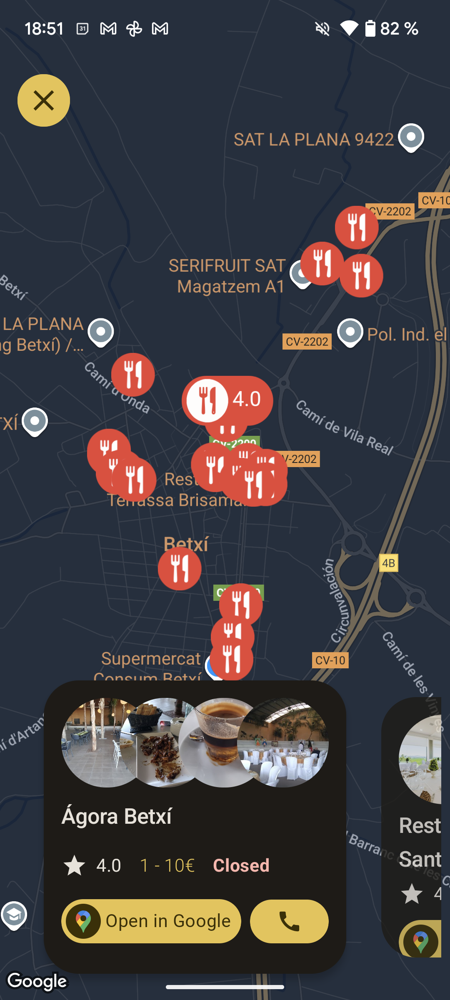 | 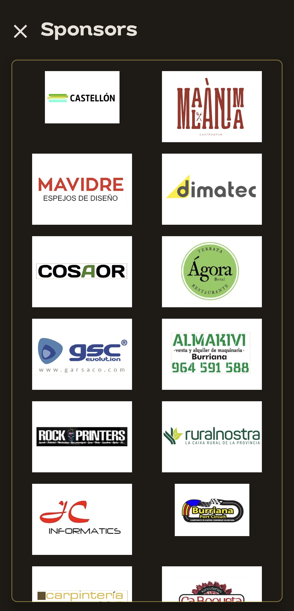 | 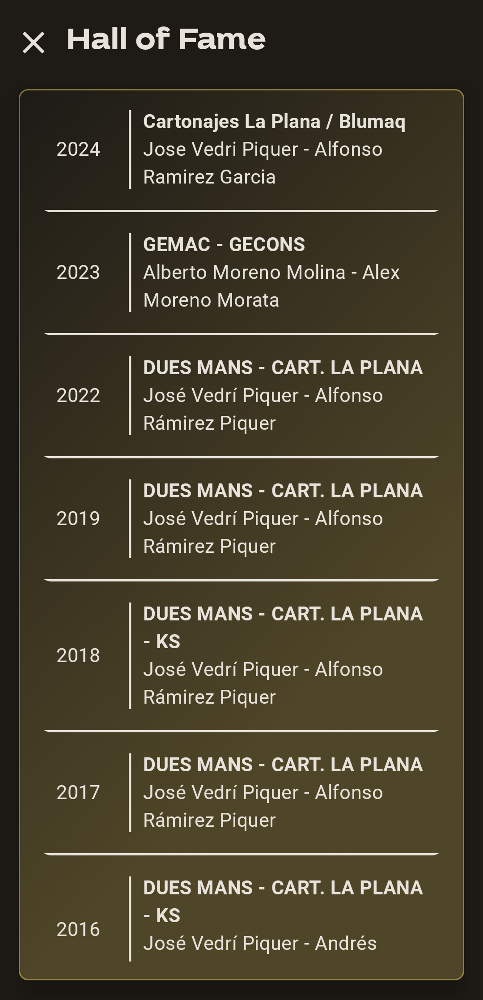 |
|:-------------------:|:------------------:|:------------------:|
| **Local Restaurants** | **Sponsors** | **Hall of Fame** |

## 📲 Installation

The application isn't publicly available for the 2025 rally, but I offer several ways to experience the project:

- **Just Want to See the App?** 👀 I can provide a guided demo or screen sharing session to showcase the functionality

- **Try it on Your Device**:
  - **Google Play** 🤖: I can provide access to install the app directly from **Play Store** into your everyday Android phone 
  - **iOS** 🍎: Limited spots available to install on your iPhone through **TestFlight**

Contact me using the information below to arrange any of these options. The app can be installed and removed like any regular application without affecting your device.

## 📄 License

This project is licensed under the MIT License - see the LICENSE file for details.

## 📬 Contact

For more information about the app or the rally, feel free to contact:  

Email: contact@pablocano.org ✉️  

LinkedIn: [Pablo Cano (CanoLabs)](https://www.linkedin.com/in/canolabs) 💼

GitHub: [@xicotet](https://github.com/Xicotet) 👨‍💻  

## 🛍️ Play Store Preview

Below are some promotional screenshots featured in the Play Store listing for the Rally Transbetxí App, showcasing the clean UI and live rally tracking features designed for fans and participants alike.

|  |  |  |
|:------------------:|:------------------:|:------------------:|
| **Follow real-time results** | **Explore interactive maps** | **Stay up to date with news** |

|  |  |
|:------------------:|:------------------:|
| **Discover all teams** | **All rally info in your pocket** |

